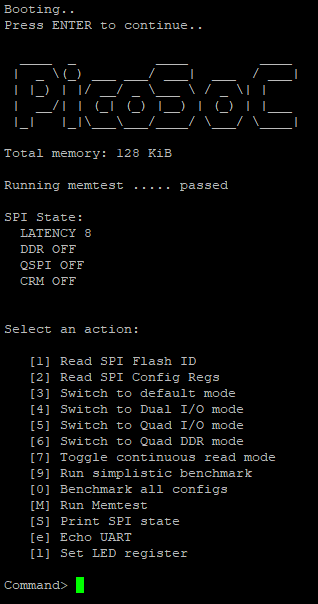

# PicoSoC + PicoRV32 Example

Based on [iCESugar PicoSoC example](https://github.com/wuxx/icesugar/tree/master/src/advanced/picorv32/picosoc) by wuxx.

| Make target     | Description                                         |
| --------------- | --------------------------------------------------- |
| `make`          | Build SoC and firmware into flashable bitstream     |
| `make core`     | Build SoC and RV32I CPU core                        |
| `make firmware` | Compile and link firmware                           |
| `make image`    | Combine SoC and firmware into bitstream             |
| `make clean`    | Delete temporary files created by the build process |

| File                    | Description                                            |
| ----------------------- | ------------------------------------------------------ |
| `hdl/picorv32.v`        | RISC-V RV32I CPU core Verilog source                   |
| `hdl/picosoc.v`         | Top-level PicoSoC Verilog module                       |
| `hdl/icesugar.v`        | FPGA-based example implementation on iCESuagr board    |
| `hdl/spimemio.v`        | Memory controller for external SPI flash               |
| `hdl/simpleuart.v`      | Simple UART core connected directly to SoC TX/RX lines |
| `hdl/ice40up5k_spram.v` | SPRAM controller for iCE40 UP5K block RAM              |
| `icesugar.pcf`          | Pin constraints file for iCESugar board                |
| `src/start.s`           | Firmware entry point assembly source                   |
| `src/sections.lds`      | Firmware linker script                                 |
| `src/firmware.c`        | Firmware C source                                      |
