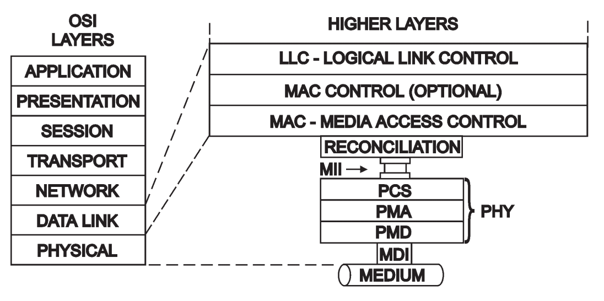

# Small Form-factor Pluggable (SFP) Transceiver Interface

This project is a combination of hardware, gateware and firmware for interfacing with 100BASE-FX SFP transceivers using an FPGA.

## Hardware
This project uses a custom designed Pmod for connecting SFP transceivers to FPGA development boards. [More info available here](https://vksdr.com/pmod#sfp).

## Protocol Layers
The Physical Layer of the 7 layer OSI model is made up of multiple sub-layers which handle communication with the physical medium.

 - Physical Medium Dependent (PMD)
   - SFP transceiver converting between optical signalling and electrical signalling
 - Physical Medium Attachment (PMA)
   - NRZ-I Serialisation/Deserialisation
   - Clock recovery from incoming signal
 - Physical Coding Sublayer (PCS)
   - Encoding/Decoding of 4b/5b symbols
 - Media Independent Interface (MII)
   - Connection of PCS to MAC
 - Media Access Controller (MAC)
   - Framing, [FCS](https://en.wikipedia.org/wiki/Frame_check_sequence) and [IPG](https://en.wikipedia.org/wiki/Interpacket_gap)

## SFP DDM/DOM 
Most SFP transceivers include an I²C monitoring interface called Digital Diagnostics Monitoring (DDM) or Digital Optical Monitoring (DOM). A host device can retrieve information about the SFP such as manufacturer, model, serial number, temperature and optical levels through this interface.
