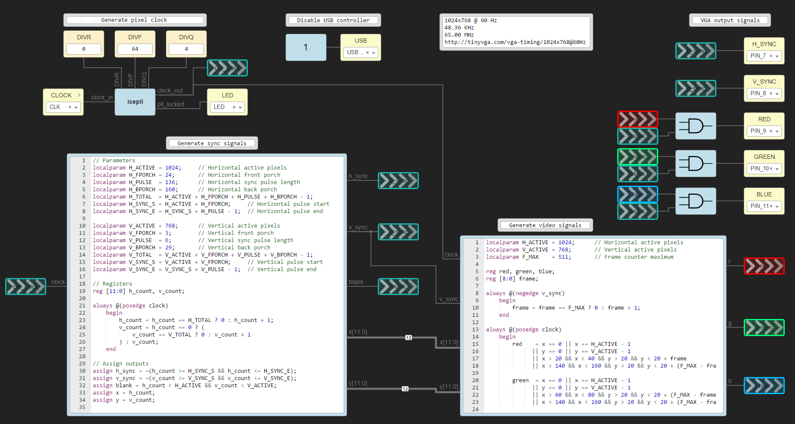

# VGA
Simple VGA driver built in [Icestudio](https://icestudio.io/).

## Resources
 - [Driving a VGA Monitor Using an FPGA - Embedded Thoughts](https://embeddedthoughts.com/2016/07/29/driving-a-vga-monitor-using-an-fpga/)
 - [VGA Signal Timing - TinyVGA](http://tinyvga.com/vga-timing)
 - [Bit Depth - Cambridge In Colour](https://www.cambridgeincolour.com/tutorials/bit-depth.htm)
 - [VGA Controller (VHDL) - Digi-Key](https://www.digikey.com/eewiki/pages/viewpage.action?pageId=15925278)
